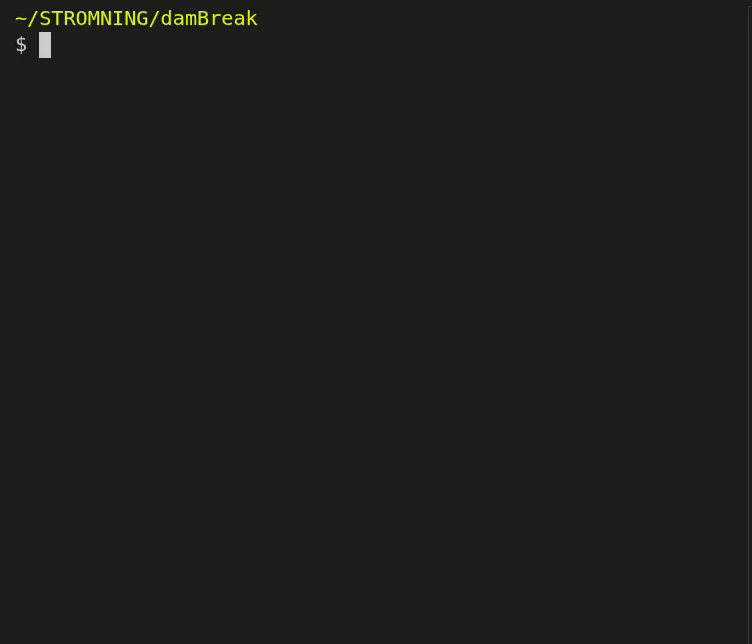

# dictator

[](https://github.com/isoAdvector/dictator/actions/workflows/tests.yml)

Inspect, set and explain OpenFOAM dictionary parameters from the command line,
with tab completion at every position.

Because OpenFOAM dictionaries should be easy to boss around:





No OpenFOAM installation is required to use it, and (in contrast to 
foamDictionary) it never reformats your files:
only the value you asked for is rewritten, so comments, layout, blank lines and
full floating point precision all survive.

## Install

```sh
git clone https://github.com/isoAdvector/dictator
source dictator/dictator
```

That is the whole install: `git clone`, then `source` the script. The `source`
lasts only for the current shell, so run it again in each new terminal — or, if
you would rather not, add that one line to `~/.bashrc`, once, from the directory
you cloned into:

```sh
echo ". $PWD/dictator/dictator" >> ~/.bashrc
```

Cloning again elsewhere and adding a second `.bashrc` line just leaves two copies
of dictator, with whichever line runs last winning.

Notes:

- `source` needs a slash in the path (`source dictator/dictator`, or an absolute
  path from elsewhere). A bare `source dictator` makes bash search `$PATH` and
  may load a different file.
- It must be sourced from **bash**; it refuses to load in other shells rather
  than misbehave quietly.
- The `dictatorHelp*` data files must stay in the same directory as the script.

## Tab completion

Completion works at every argument, so you can find a parameter without knowing
where it lives:

```
dictator sys<TAB>                            -> system/
dictator system/cont<TAB>                    -> system/controlDict
dictator system/controlDict <TAB><TAB>       -> lists every parameter
dictator system/controlDict endT<TAB>        -> endTime
dictator system/controlDict endTime <TAB>    -> fills in the current value
dictator system/controlDict writeControl <TAB> -> lists the standard values
dictator system/controlDict endTime -<TAB>   -> -help
dictator system/fvSolution solv<TAB>         -> 'solvers.
dictator system/fvSolution 'solvers."pc<TAB> -> 'solvers."pcorr.*".
dictator $FOAM_TUT<TAB>                      -> $FOAM_TUTORIALS/
```

Paths written with OpenFOAM's environment variables complete as they would
anywhere else in bash, and keep the short `$FOAM_TUTORIALS/...` form on the
command line rather than expanding to the full path.

Sub-dictionaries keep a trailing `.` so TAB steps into them one level at a time.
Names containing `(`, `)` or `*` need quoting. TAB opens the quote itself as soon
as the path leads to such a name, and closes it once the name is complete, so the
names stay readable as OpenFOAM writes them instead of turning into backslashes.

## Reading and setting

With two arguments dictator prints a value, with three it sets one:

```sh
dictator system/controlDict endTime         # 0.1
dictator system/controlDict endTime 12      # Set   endTime = 12
dictator system/controlDict banana ripe     # Added banana = ripe
```

Entries are addressed by their full path from the top of the file, with
sub-dictionaries separated by `.`:

```sh
dictator system/fvSchemes ddtSchemes.default "CrankNicolson 0.9"
dictator system/fvSolution 'solvers."alpha.water.*".nAlphaSubCycles' 4
```

A parameter that does not exist yet is added after the last entry of the
dictionary named in the path. The path is taken at face value, so it is your job
to check that a new entry landed where you meant it; the `Added` versus `Set`
message is there to make a typo obvious.

### Standard values

Where a keyword takes one of a fixed set of words, TAB offers that set at the
value slot rather than the value already in the file, and completes a partial
one. Only the set is offered, so a value in the file that is not part of it --
the typo you are about to correct -- does not appear as though it were:

```
$ dictator system/controlDict writeControl <TAB><TAB>
adjustable         clockTime          none               timeStep
adjustableRunTime  cpuTime            runTime
$ dictator system/controlDict writeControl adjust<TAB>
$ dictator system/controlDict writeControl adjustable
```

Setting a value outside the set writes it anyway and says so. OpenFOAM
dictionaries legitimately carry values no database knows about, so this is a
warning rather than a refusal, and it is what catches a typo:

```
$ dictator system/controlDict writeControl runTme
Set   writeControl = runTme in system/controlDict
Warning: runTme is not a standard value for writeControl
  standard: timeStep | runTime | adjustable | adjustableRunTime | clockTime | cpuTime | none
```

This covers `controlDict`'s time and write controls and `fvSolution`'s solver,
preconditioner and agglomerator names. Only a list recorded for the dictionary
being edited is used: `type`, `format`, `mode` and `order` all carry a list of
their own somewhere in OpenFOAM, and completing or warning from an unrelated
dictionary's list would be worse than staying quiet.

Some lists are a sample rather than the whole space -- the `fvSchemes` defaults
run to hundreds of valid values. Those end in `...`: TAB still offers them, and
alongside them the value already in the file, since a sample settles nothing;
nothing is warned against either:

```
$ dictator system/fvSchemes divSchemes.default -help
...
  options: none | Gauss linear | Gauss upwind | Gauss limitedLinear 1 | ...
```

## Parameter documentation

A third argument of `-help` explains the parameter instead of setting it: its
current value, its type, whether the solver requires it, its default, the
permitted options where there are few, and what it means.

```
$ dictator system/controlDict writeControl -help
writeControl  =  adjustable
  word, optional, default timeStep   [controlDict, curated, v2506]
  What writeInterval is counted in. adjustable also nudges the time step so
  writes land on exact intervals.
  options: timeStep | runTime | adjustable | adjustableRunTime | clockTime |
  cpuTime | none
```

A parameter the OpenFOAM sources never read says so, rather than guessing:

```
$ dictator system/fvSchemes ponzi -help
ponzi
  No information. Not a keyword found in the OpenFOAM v2506 reference sources,
  so probably added by you, read by a custom solver or function object, or
  from a release where it differs.
```

The bracket names the dictionary the description was found in, where it came
from, and the OpenFOAM release it describes, so an answer taken from a different
dictionary is visible as such.

### The whole dictionary

`-help` with no parameter describes the file itself: what the dictionary is for
and a minimal example.

```
$ dictator system/decomposeParDict -help
decomposeParDict
  How decomposePar splits the mesh for a parallel run: the number of
  subdomains (one per MPI rank) and the partitioning method. scotch and kahip
  need no further input; simple and hierarchical take an n (x y z) split;
  manual reads a per-cell decomposition from a file.

  example:
    numberOfSubdomains  8;

    method              scotch;
```

The core system and constant dictionaries are covered (`controlDict`,
`fvSolution`, `fvSchemes`, `decomposeParDict`, `blockMeshDict`,
`snappyHexMeshDict`, `setFieldsDict`, `transportProperties`,
`turbulenceProperties`, `g`). The text is hand-written, one block per FoamFile
object, in `dictatorHelp.files` beside the script; add more there.

### Standard sub-dictionaries

The listing shows the parameters already in a file. To see every standard key a
known sub-dictionary accepts, ask for `-help` on the sub-dictionary itself,
either as `PIMPLE` or as the `PIMPLE.` that TAB leaves on the line. The
single-entry answer is followed by a table: each key's current value in the
file, or `(not set)`, its type and default, and what it does. Keys present in
the file that the database does not know are listed at the end, which catches a
misspelt one.

```
$ dictator system/fvSolution PIMPLE -help
PIMPLE
  dictionary, optional   [fvSolution, curated, v2506]
  Controls for the PIMPLE pressure-velocity loop used by transient solvers.

  standard keys:

  nOuterCorrectors  =  3
    label, optional, default 1
    Outer PIMPLE iterations per time step. 1 makes PIMPLE behave as PISO; more
    lets you take a larger time step at the cost of work per outer iteration.

  momentumPredictor  =  no
    Switch, optional, default true
    Whether the momentum equation is solved before the first pressure
    correction. Often turned off for interface-dominated or creeping flows.

  nCorrectors   (not set)
    label, optional, default 1
    Pressure-correction (PISO) solves per outer iteration.
  ...

  also set here, not in the database: turbulentPotato
```

`PIMPLE`, `SIMPLE` and `PISO` in `fvSolution`, and the scheme sub-dictionaries in
`fvSchemes`, are covered. These lists are hand-curated from the OpenFOAM
sources; add more as `SubDict.key` records in `dictatorHelp.curated`.

A sub-dictionary table runs well past a screen, so on an interactive terminal
`-help` output is sent through a pager (`less`, or `$PAGER`, or
`$DICTATOR_PAGER`); short answers still print straight out, and
`DICTATOR_PAGER=cat` turns paging off.

### Where the text comes from

The 5802 records in `dictatorHelp` are generated from an OpenFOAM source tree by

```sh
makeDictatorHelp [openfoamRoot] > dictatorHelp
```

which defaults to `$WM_PROJECT_DIR`. Five extractors read the tree: typed and
untyped dictionary reads give the type, the required flag and the default;
doxygen property tables and the commented templates in `etc/caseDicts/annotated`
give the prose; `Enum` tables give the option lists. Every record keeps the
extractor it came from in its last field.

The core entries of controlDict, fvSolution and fvSchemes, where the sources
state a type but never say what the parameter means, are written by hand and
marked `curated` so that distinction stays visible. Their options field is what
drives value completion and the non-standard-value warning, so a list added
there has to be exhaustive, or end in `...` to say that it is not.

**The shipped database describes Keysight OpenFOAM (openfoam.com) v2506**, the
release read from `META-INFO/api-info`, stamped into the file and shown in
every `-help` answer. The standard case dictionaries — `controlDict`,
`fvSolution`, `fvSchemes`, `decomposeParDict` and the rest — were compared
across the v2212, v2412, v2506 and v2512 sources: their keywords, types and
file syntax are unchanged over that span, so the database applies as-is to
roughly **v2206–v2606**. A few extracted defaults for niche models or function
objects can differ between releases; regenerate against your own tree with
`makeDictatorHelp` to be exact.

The OpenFOAM Foundation line (openfoam.org, versions 11–13) has renamed and
restructured several of these dictionaries — `transportProperties` became
`physicalProperties`, `turbulenceProperties` became `momentumTransport`,
`fvOptions` split into `fvModels` and `fvConstraints` — and is not covered.

## The underlying functions

```sh
setDictEntry     <file> <entry.path> <value>   # set one entry
getDictEntry     <file> <entry.path>           # print one entry's value
listDictEntries  <file>                        # print every entry path
```

All three share one parser, which reads the dictionary as a character stream, so
entries and sub-dictionaries may be split across lines or packed onto one,
separated by spaces, tabs or nothing at all. Entries inside `//` or `/* */`
comments are ignored, as are `#include` and other `#directive` lines.

`setDictEntry` does not add a missing entry, reporting it as an error instead;
pass `-add` for dictator's behaviour. Scripts should use `setDictEntry` so that a
mistyped name fails loudly. Removing entries is not supported.

The dictionary dialect is set by the variable `dictSyntax`. Only `openfoam` is
currently defined: entries `key value;` and sub-dictionaries `name { ... }`. The
dialect is six tokens, so another brace-and-terminator format is a one-line
addition; formats that express nesting through indentation, such as YAML, do not
fit this model.

## Tests

```sh
./test/run_tests.sh
```

Sources `dictator` and exercises every entry point and helper against a torture
fixture in `test/fixtures/`: packed and split entries, list values, nested
parentheses, empty values, duplicated keys, deep and quoted sub-dictionaries,
comments and `#include` lines, `-add` placement, formatting preservation,
error paths and exit codes, and the completion function at each argument. Each
check prints `ok` or `FAIL`, with a summary and a non-zero exit on any failure.

`dictator` shells out to `awk`, and the dialects disagree in ways that have bitten
it before, so the whole suite is re-run once per `awk` found on the machine — the
ambient one plus `gawk`, `mawk`, `busybox awk` and `original-awk` when present. A
green run means they all agree. `QUIET=1` hides the passing lines;
`DICTATOR_TEST_AWKS="default gawk"` restricts which are tried. See
[test/README.md](test/README.md).

## See also

[cfdTools](https://github.com/isoAdvector/cfdTools) — `parmScanner`, which builds
and runs a matrix of cases from a base case, using `setDictEntry` from here.

## License

Copyright (C) 2025-2026 Johan Roenby, STROMNING.

dictator is free software: you can redistribute it and/or modify it under the
terms of the GNU General Public License as published by the Free Software
Foundation, either version 3 of the License, or (at your option) any later
version. It is distributed in the hope that it will be useful, but WITHOUT ANY
WARRANTY; without even the implied warranty of MERCHANTABILITY or FITNESS FOR A
PARTICULAR PURPOSE. See [LICENSE](LICENSE), or
<https://www.gnu.org/licenses/>, for details.
